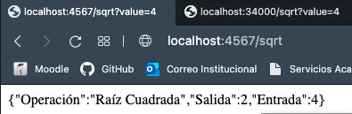
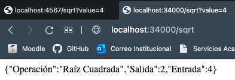
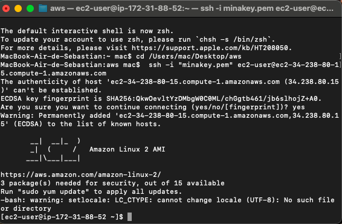
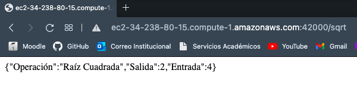
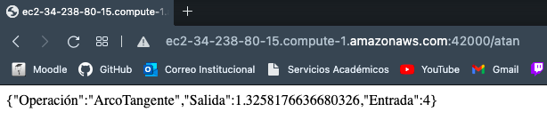

# PARCIAL2-AREP

>Diseñé, construya y despliegue los siguientes servicios en un microcontenedor docker desplegado en una instancei a EC2 de AWS. Cada estudiante debe seleccionar para desarrollar dos funciones matemáticas de acuerdo a los dos últimos dígitos de su cédula como se especifica en la lista. Todas las funciones reciben un solo parámetro de tipo "Double" y retornan una prámetro sde tipo "Double".

>Implemente los servicios para responder al método de solicitud HTTP GET. Deben usar el nombre de la función especificado en la lista y el parámetro debe ser pasado en la variable de query con nombre "value".

## Prueba en Local

## Prueba puerto Docker

## Prueba AWS Máquina

## Prueba AWS Función SQRT

## Prueba AWS Función ATAN

## Video AWS Prueba funciones

https://youtu.be/ZzFJ2iXgfy4
